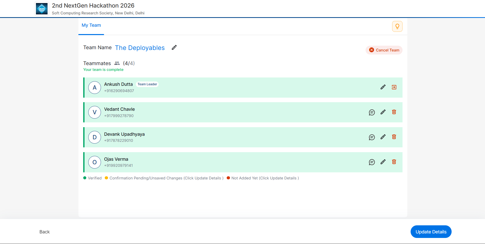

# CA-1 : Dev-Ops

| PRN | Student | GitHub |
| --- | --- | --- |
| 23070122032 | Ankush Dutta | [GenDelta](https://github.com/GenDelta) |
| 23070122153 | Ojas Verma | [Ojas-verma](https://github.com/Ojas-verma) |
| 23070122229 | Vedant Chavle | [veda-ui](https://github.com/veda-ui) |
| 23070122271 | Devank Upadhyaya | [DevankU](https://github.com/DevankU) |

**Track:** Cybersecurity for the future

**Devops TH1/TH2:** TH2

**Submission Date:** 08/08/2026

**Problem Statement Link:** [2nd NextGen Hackathon 2026](https://unstop.com/hackathons/2nd-nextgen-hackathon-2026-soft-computing-research-society-new-delhi-delhi-1722019)

**Project Repo:** [Link](https://github.com/GenDelta/cnn-ids)

**Proof of Participation:**



## ML-Based IDS

ML-Based IDS is a CNN-driven intrusion detection project built on the CICIDS2017 traffic dataset. The model converts tabular flow features into 2D traffic matrices and performs multi-class classification across benign and attack classes.

## Project Goals

- Detect malicious network traffic with high recall.
- Keep a reproducible training and evaluation workflow in a single notebook.
- Provide a practical offline demo interface for presentation and validation.

## Repository Structure

- `ids_model.ipynb`: end-to-end training, evaluation, and visualization notebook.
- `prepare_demo_assets.py`: creates demo artifacts from datasets and checkpoint.
- `inference_pipeline.py`: reusable inference and alert logic.
- `app.py`: Streamlit demo interface.
- `validate_demo_assets.py`: pre-demo validation script.
- `requirements.txt`: Python dependencies.

## Model Summary

- Input representation: scaled numeric flow features transformed to `9x9x1` matrix.
- Architecture: `Conv2D -> Conv2D -> MaxPooling -> Flatten -> Dense -> Dropout -> Dense(softmax)`.
- Task: 11-class traffic classification.
- Best checkpoint: `Checkpoints/cnn_model_epoch_10_val_acc_0.9527.keras`.

## Demo Application

The Streamlit app is built for a reliable offline demo and includes:

- Single Sample: classify one record and inspect top class probabilities.
- Timeline Replay: simulate normal-to-attack transition and alerting behavior.
- Batch Summary: generate classification metrics and confusion matrix for a selected subset.
- Model Insights: class-level diagnostic views and confusion-pair analysis.

## Quick Start

1. Create and use a virtual environment.
2. Install dependencies:

```bash
uv venv
uv pip install -r requirements.txt
```

3. Prepare demo assets:

```bash
uv run python prepare_demo_assets.py
uv run python validate_demo_assets.py
```

4. Launch the demo UI:

```bash
uv run streamlit run app.py
```

## Notes

- The demo is intentionally offline and replay-based for reliability.
- Alerting policy in the app: predicted class is not `BENIGN` and confidence is above the configured threshold.

<!-- Documentation-only update: added note on 2026-08-08 indicating small non-functional edits made across several project files for traceability. -->
