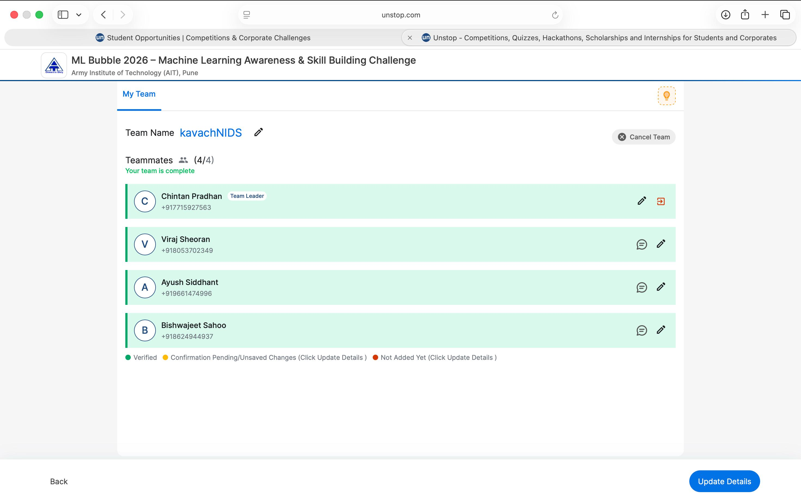
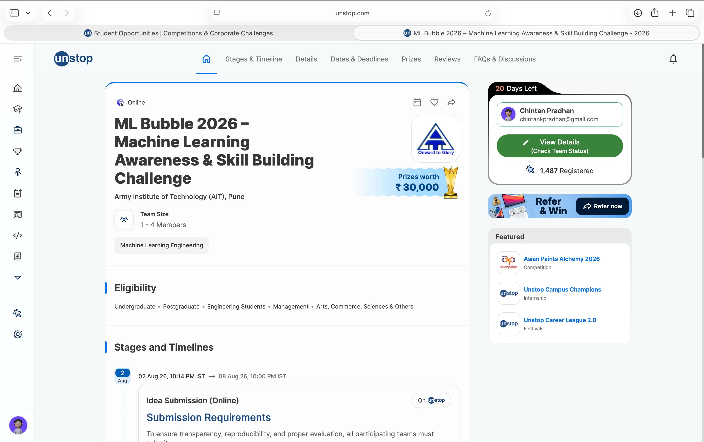

# DevOps CA1 — Task 3

## Task 3 Submission

This repository contains our **DevOps CA1 Task 3 submission**.

For Task 3, our group selected a **hackathon challenge** as our chosen problem statement.

### Selected Hackathon

**ML Bubble 2026 – Machine Learning Awareness & Skill Building Challenge**

**Organized by:** Army Institute of Technology (AIT), Pune

**Hackathon Link:**  
https://unstop.com/hackathons/ml-bubble-2026-machine-learning-awareness-skill-building-challenge-army-institute-of-technology-ait-pune-1729558

---

## Proof of Participation

### Registration / Participation



### Hackathon Details



---

## Team Members

| S. No. | Name | Roll Number |
|---:|---|---|
| 1 | Chintan Pradhan | 23070122077 |
| 2 | Viraj Sheroan | 23070122074 |
| 3 | Bishwajeet Sahoo | 23070122073 |
| 4 | Ayush Siddhant | 23070122066 |

---

## Repository Structure

```text
DevOps-CA1_2023_27/
│
├── README.md
│
├── screenshots/
│   ├── proof-of-participation-1.jpeg
│   └── proof-of-participation-2.jpeg
│
└── Task3-Chintan_Viraj_Bishwajeet_Ayush/
    ├── README.md
    ├── ML_Bubble_2026_Defense_IDS.ipynb
    ├── ids_categorical_encoders.joblib
    ├── ids_scaler.joblib
    ├── ids_target_encoder.joblib
    └── ids_xgboost_model.joblib
