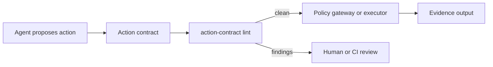

# Agent Action Contract

[](https://github.com/njs2017/agent-action-contract/actions/workflows/ci.yml)
[](https://www.python.org/)
[](LICENSE)

**Lint AI agent actions for bounded authority, approval, recovery, cost, and evidence.**

Permission policies answer *may this agent call this tool?* An action contract also answers:

- Who is acting, and for which delegated principal?
- Which resources and side effects are in scope?
- When does the authority expire?
- Is explicit human approval required?
- Can the action be undone?
- What can it cost?
- What evidence proves completion?

The CLI is deterministic, local, provider-neutral, and does not call an LLM.

## Two-minute quickstart

Verify the CLI directly from GitHub with `uvx`:

```bash
uvx --from git+https://github.com/njs2017/agent-action-contract action-contract --help
```

Clone to run the included contracts:

```bash
git clone https://github.com/njs2017/agent-action-contract.git
cd agent-action-contract
uv sync --locked --group dev
uv run action-contract lint examples/unsafe-deploy.yaml
```

Expected result:

```text
FAIL unsafe.production.deploy
  AC001 [error] approval.mode: High and critical risk actions require explicit approval.
  AC002 [error] delegation.expires_at: Write and destructive actions require an expiring delegation.
  AC004 [error] approval.mode: Irreversible actions require explicit approval.
  AC005 [error] notification.timing: Irreversible actions require notification before execution.
  AC007 [error] evidence.outputs: Every action must declare at least one evidence output.
```

Exit status is `1`, so the same command can gate CI.

## Contract example

```yaml
version: "1"
id: repository.report.write
description: Write a generated report into a Git repository
actor:
  id: report-agent
  type: agent
delegation:
  principal: user:maintainer
  expires_at: "2026-07-20T18:00:00Z"
capability: filesystem.write
effect: write
resources:
  - file:reports/output.md
risk: medium
approval:
  mode: explicit
recovery:
  reversible: true
  undo: git restore reports/output.md
notification:
  timing: before
cost:
  kind: free
evidence:
  outputs:
    - sha256:reports/output.md
    - git:working-tree-diff
```

See [`examples/`](examples/) for safe read, reversible write, irreversible deployment, and intentionally unsafe contracts.

## Commands

```bash
# JSON Schema only
uv run action-contract validate examples/safe-read.yaml

# Schema plus semantic safety rules
uv run action-contract lint examples/reversible-write.yaml

# Deterministic authority/recovery summary
uv run action-contract explain examples/irreversible-deploy.yaml

# Machine-readable CI output
uv run action-contract lint examples/unsafe-deploy.yaml --format json

# GitHub Actions annotation output
uv run action-contract lint examples/unsafe-deploy.yaml --format github-actions
```
The `github-actions` format emits each finding as a GitHub Actions `::error` annotation, preserving the finding's rule ID, path, and message. This format is intended for CI workflows so findings appear directly in workflow logs and annotations.

| Exit code | Meaning |
|---:|---|
| `0` | Structurally valid and policy-clean |
| `1` | Schema or policy findings |
| `2` | File or parsing error |

## Rules

| Rule | Requirement |
|---|---|
| `AC001` | High and critical risk actions require explicit approval |
| `AC002` | Write and destructive actions require expiring delegation |
| `AC003` | Reversible actions must declare undo instructions |
| `AC004` | Irreversible actions require explicit approval |
| `AC005` | Irreversible actions require notification before execution |
| `AC006` | Paid actions require a maximum amount and currency |
| `AC007` | Every action must declare at least one evidence output |

Structural validation uses the bundled [JSON Schema](src/agent_action_contract/action-contract.schema.json). Rule IDs and output ordering are stable within schema version `1`.

## Where it fits



Agent Action Contract complements rather than replaces:

- permission manifests that decide whether tools are visible or callable;
- policy engines and gateways that enforce runtime authorization;
- sandboxes that isolate execution;
- audit systems that retain the resulting evidence.

The contract is a portable, reviewable boundary that those systems can generate or consume.

## Limitations

- This project validates declarations; it does not enforce them at runtime.
- A valid contract does not prove that an agent or executor followed it.
- Risk classification is supplied by the caller and should be reviewed for consequential actions.
- Schema version `1` is intentionally small and may evolve before a stable release.
- The examples use public, generic workflows. The project contains no private employer code, data, policies, or architecture.

## Development

```bash
uv sync --group dev
uv run ruff check .
uv run ruff format --check .
uv run mypy
uv run pytest
uv build
```

CI repeats these checks on Python 3.11, 3.12, and 3.13, then installs the built wheel in a clean environment and exercises all three commands.

## Contributing

Focused integrations, rule discussions, and real-world contract examples are welcome. Read [CONTRIBUTING.md](CONTRIBUTING.md) before opening a pull request.

## License

Apache License 2.0. See [LICENSE](LICENSE).
