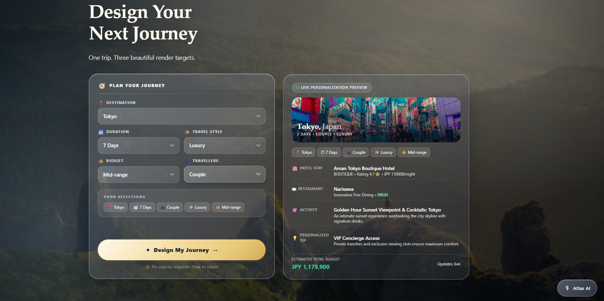
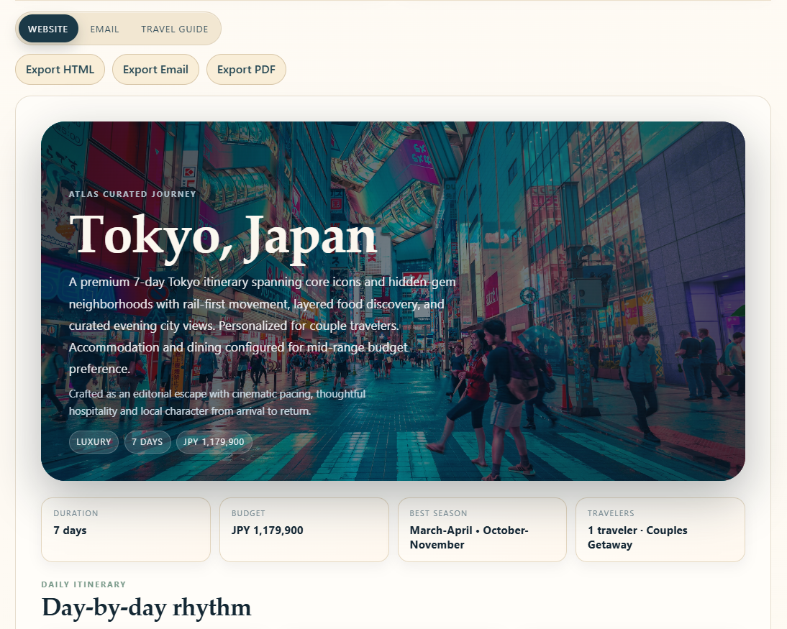
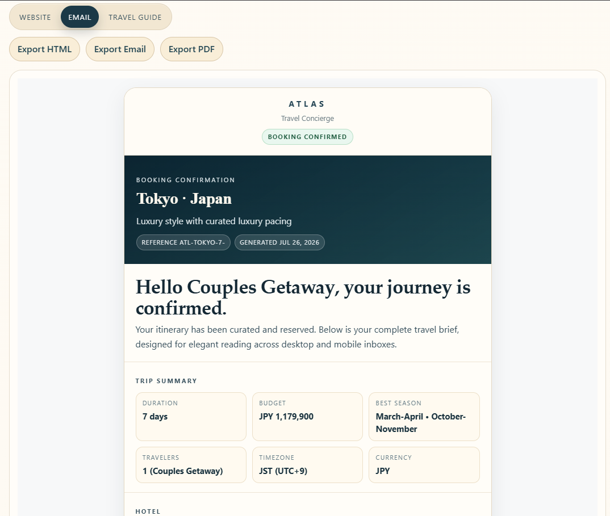

# Atlas

> **Build Once. Render Everywhere.**

Atlas uses a single structured `Trip` model and **Unlayer Elements** to render the same travel content across web, email, and printable document formats — built as an entry for **Unlayer's Build With Elements open-source challenge**.

---

## 🌟 Overview

Rather than maintaining three separate implementations for a website, an email, and a printable guide, Atlas defines one strongly-typed `Trip` data model and feeds it through `@unlayer/react-elements` renderers. The same underlying content — destination overview, itinerary, stays, dining, budget — comes out as an interactive **Web Application** (`Page`), a responsive **HTML Email** (`Email`), and a print-optimized **Travel Guide Document** (`Document`), with zero duplication of presentation or business logic.

---

## ✨ Features

- **Dynamic Hero Planner**: Customized journey builder with real-time feedback.
- **Live Personalization Preview**: Instant visual preview card updating as user selections change.
- **Personalization Engine**: Rule-based customization layer adjusting stays, activities, dining, tips, and budget allocations.
- **AI Voice Concierge**: Interactive voice assistant powered by ElevenLabs WebRTC SDK.
- **Multi-Target Rendering**:
  - **Website Renderer**: Cinematic, full-screen editorial web guide (`Page`).
  - **Email Renderer**: Clean, inline-compatible HTML email template (`Email`).
  - **Travel Guide Renderer**: Structured, chapter-based printable document (`Document`).
- **One-Click Export**: Native export capabilities for Website HTML, Email HTML, and PDF guides.
- **Local Dataset Architecture**: Rich, pre-curated datasets for Tokyo, Dubai, and Istanbul.
- **Adaptive Layouts**: Responsive CSS Grid & Flexbox system tuned for desktop, tablet, and mobile viewports.

---

## 🖼️ Screenshots

### Landing Page & Live Preview


### Website Renderer


### Email Renderer


### Travel Guide Renderer


---

## 🧠 Personalization Engine

The Atlas Personalization Engine (`src/lib/personalization/`) takes a base destination itinerary and dynamically shapes it based on three user-selected dimensions:

1. **Traveler Type** (`Solo`, `Couple`, `Friends`, `Family`): Adjusts room types, dining atmospheres, and activity group dynamics.
2. **Travel Style** (`Adventure`, `Luxury`, `Food`, `Culture`, `Nature`, `Romantic`, `Business`): Filters and injects curated activity highlights and local tips.
3. **Budget Tier** (`Budget`, `Mid-range`, `Luxury`): Re-calculates total budget, per-night accommodation rates, dining price tiers, and daily spend estimates.

---

## 👁️ Live Personalization Preview

Positioned alongside the planner card, the **Live Personalization Preview** (`LivePreviewCard.tsx`) provides instantaneous feedback before journey generation. It reflects the user's selected destination image, compact travel tags, featured stay, dining spotlight, activity teaser, personalized local tip, and estimated total budget in real time.

---

## 🎙️ AI Concierge (ElevenLabs Integration)

Atlas features a floating AI Voice Assistant widget built with `@elevenlabs/react`:
- **WebRTC Voice Connection**: Low-latency, bidirectional audio streaming.
- **Real-Time State Indicators**: Visual ring animations reflecting connection, listening, and speaking states.
- **Concierge Capability**: Answers traveler questions regarding destinations, trip pacing, and local recommendations.

---

## 🎨 Renderers (React Elements)

Powered by `@unlayer/react-elements`:

| Render Target | Component | Container | Description |
| :--- | :--- | :--- | :--- |
| **Website** | `TripPage.tsx` | `<Page>` | Cinematic web experience featuring full-bleed hero media, quick facts grid, day-by-day rhythm cards, budget breakdown, and local insights. |
| **Email** | `TripEmail.tsx` | `<Email>` | Table-safe HTML layout optimized for email clients (Gmail, Outlook, Apple Mail) with CTA buttons and summary cards. |
| **Travel Guide** | `TripDocument.tsx` | `<Document>` | Multi-chapter editorial document with clean page flow, cover page, stay details, dining guide, packing checklist, and safety contacts. |

---

## 📤 Export Functionality

Atlas provides programmatic client-side export helpers (`src/utils/export.ts`):
- **Export HTML**: Downloads a standalone HTML webpage of the trip.
- **Export Email**: Generates production-ready, styled email HTML markup.
- **Export PDF**: Opens print preview for instant save-to-PDF functionality.

---

## 🛠️ Tech Stack

- **Frontend**: React 18, TypeScript, Vite
- **Render Engine**: `@unlayer/react-elements`
- **Voice Agent**: `@elevenlabs/react` SDK
- **Styling**: Modern Vanilla CSS (Design Tokens, Glassmorphism, CSS Grid & Flexbox)

---

## 📂 Local Dataset Architecture

Atlas includes rich local dataset models (`src/data/`) supporting 3, 5, and 7-day itineraries for:
- 🇯🇵 **Tokyo, Japan**
- 🇦🇪 **Dubai, United Arab Emirates**
- 🇹🇷 **Istanbul, Turkey**

Each dataset strictly adheres to the `Trip` schema (`src/types/trip.ts`), providing complete destination overviews, weather snapshots, lodging, dining, transport legs, packing checklists, local tips, and emergency contacts.

---

## 📁 Project Structure

```text
aitravel/
├── public/                     # Static assets & screenshots
├── server/                     # Optional backend services
├── src/
│   ├── assets/                 # SVGs and static media
│   ├── context/                # React context providers
│   ├── data/                   # Tokyo, Dubai & Istanbul datasets
│   ├── elements/               # LivePreviewCard & UI elements
│   ├── hooks/                  # Custom React hooks
│   ├── lib/
│   │   └── personalization/    # Personalization engine rules
│   ├── pages/                  # Page components & Dashboard
│   ├── renderers/
│   │   ├── document/           # Travel Guide Document renderer
│   │   ├── email/              # Email renderer
│   │   └── page/               # Website Page renderer
│   ├── services/               # API & voice service handlers
│   ├── types/                  # TypeScript definitions (Trip, etc.)
│   ├── utils/                  # Export utilities (HTML, PDF, Email)
│   ├── App.tsx                 # Main application landing & engine
│   ├── App.css                 # Core CSS design system
│   └── main.tsx                # Application entry point
├── index.html
├── package.json
├── tsconfig.json
└── vite.config.ts
```

---

## 🚀 Setup & Installation

### Prerequisites
- Node.js (v18+ recommended)
- npm or yarn

### Steps

1. **Clone the Repository**:
   ```bash
   git clone https://github.com/Bitsnbytes14/atlas.git
   cd atlas
   ```

2. **Install Dependencies**:
   ```bash
   npm install
   ```

3. **Start Development Server**:
   ```bash
   npm run dev
   ```
   Open `http://localhost:5173` in your browser.

4. **Build for Production**:
   ```bash
   npm run build
   ```

---


## 🔮 Future Improvements

- Additional global destination datasets (Paris, London, New York).
- Live weather forecast API integration.
- Dynamic flight & hotel booking partner link generators.
- Interactive map rendering for daily activity pins.
- User account authentication & trip bookmarking.

---

## 📄 License

This project is licensed under the [MIT License](LICENSE).

---

**Built with ❤️ for Unlayer's Build With Elements Open Source Challenge**

---

## 👥 Team

**Group 4**

| Field | Value |
| :--- | :--- |
| **Students** | Gunveer Singh, Harsh Rajput, Mohammad Ahmad, Raghav Sharma |
| **Genre** | Open Source Challenge |
| **Problem Statement** | Participate in Unlayer's Build With Elements open-source challenge by building Atlas, an AI-powered travel planning application that uses Unlayer Elements as a core rendering layer to transform a single structured travel itinerary into consistent interactive web content, responsive email content, and a printable travel guide. |
