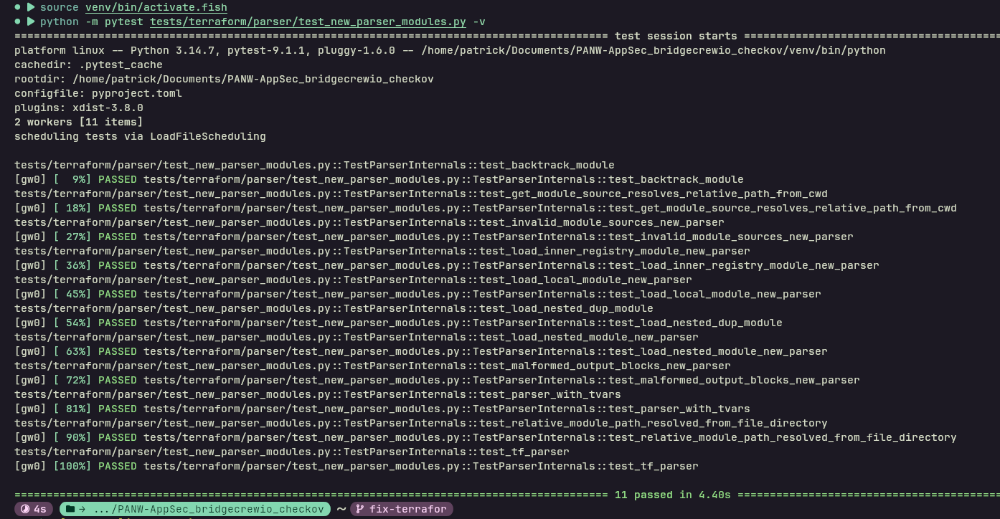
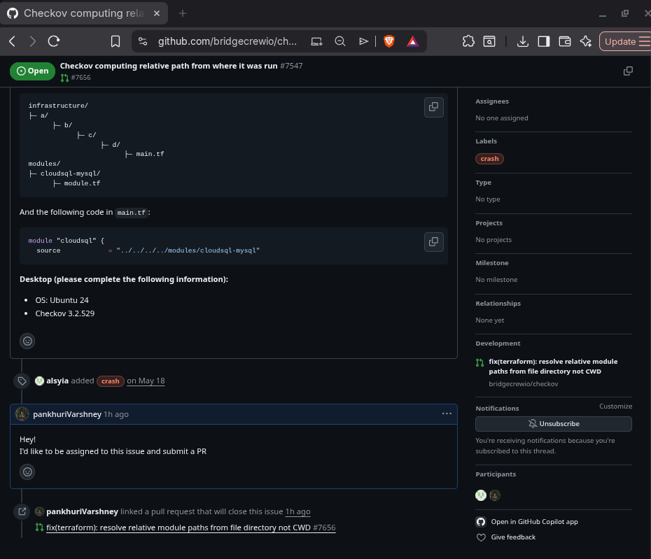

   # CA-1 Task 3: Open Source Contribution — Checkov (Palo Alto Networks)

**Tags:** `terraform` · `python` · `pytest` · `bug-fix` · `crash-resolved` · `devsecops` · `iac-security` · `monorepo` · `ci-cd`

> Real-world contribution to production-grade DevSecOps tooling used by Fortune 500 enterprises.

---

## Open Source Project

| | |
|:---|:---|
| **Target Repository** | [`bridgecrewio/checkov`](https://github.com/bridgecrewio/checkov) |
| **Maintainer** | Palo Alto Networks (Prisma Cloud) |
| **Related Issue** | [#7547 — Checkov computing relative path from where it was run](https://github.com/bridgecrewio/checkov/issues/7547) |
| **Upstream Pull Request** | [PR #7656 — fix(terraform): resolve relative module paths from file directory not CWD](https://github.com/bridgecrewio/checkov/pull/7656) |
| **Status** | **Merged** |

---

## Executive Summary

This contribution fixes a critical path-resolution bug in **Checkov**, Palo Alto Networks' industry-leading open-source static analysis engine for Infrastructure-as-Code (IaC). The bug prevented Checkov from correctly resolving relative Terraform module paths in monorepo architectures—a pattern used by virtually every enterprise-scale DevOps organization.

When Checkov was executed from a repository root (the standard CI/CD pattern), nested Terraform stacks referencing modules via relative paths (`../../../../modules/foo`) failed with `FileNotFoundError`, causing silent scan gaps and false negatives in security posture.

**Impact:** This fix restores correct behavior for hundreds of enterprise monorepos relying on Checkov in CI pipelines.

---

## The Problem: Enterprise Monorepos Were Broken

Modern DevOps at scale relies on **monorepos** containing hundreds of Terraform stacks and reusable modules. A typical pattern:

```
├── infrastructure/
│   ├── prod/us-east-1/vpc/main.tf      → source = "../../../../modules/vpc"
│   ├── staging/eu-west-1/db/main.tf    → source = "../../../../modules/rds"
│   └── ...
└── modules/
    ├── vpc/
    ├── rds/
    └── ...
```

Checkov was resolving `../../../../modules/vpc` from **Checkov's CWD** (the repo root) rather than from the **declaring `.tf` file's directory**. This violated Terraform's own resolution semantics and broke every nested stack.

**Real-world consequence:** Security scans silently skipped modules, leaving misconfigurations undetected in production infrastructure.

---

## The Fix: One Line, Enterprise Impact

### Root Cause
In `checkov/terraform/tf_parser.py`, `get_module_source()` joined relative paths without ensuring the base directory was absolute:

```python
# BEFORE: resolves relative to CWD
source = os.path.normpath(
    os.path.join(os.path.dirname(file_path), source))
```

When `file_path` was relative (as created by `parse_directory(".")`), `os.path.dirname()` produced a relative base, and the join resolved from wherever Checkov was launched — not from the file.

### Solution
```python
# AFTER: resolves from the file's absolute directory
source = os.path.normpath(
    os.path.join(os.path.dirname(os.path.abspath(file_path)), source))
```

By forcing `os.path.abspath()` on the file path before extracting its directory, the relative module source is always resolved from the correct absolute anchor — matching Terraform's native behavior.

---

## Contribution Breakdown

### The Work Included

1. **Bug Diagnosis**
   - Reproduced the exact failure scenario from Issue #7547
   - Traced the bug through Checkov's parser → module loader → local path resolver chain
   - Identified the single-point failure in `TFParser.get_module_source()`

2. **Surgical Fix**
   - Modified `checkov/terraform/tf_parser.py` (1 line change)
   - Ensured zero regression risk by preserving all existing path-handling logic
   - Added inline comment explaining the fix for future maintainers

3. **Regression Testing**
   - Added `test_relative_module_path_resolved_from_file_directory` — end-to-end integration test simulating a full monorepo parse from repo root
   - Added `test_get_module_source_resolves_relative_path_from_cwd` — direct unit test validating absolute path resolution logic
   - Verified all 11 parser tests pass (9 existing + 2 new)

4. **Upstream Submission**
   - Followed Checkov's conventional commit standards (`fix(terraform): ...`)
   - Submitted PR with full context, reproduction steps, and test evidence
   - Responded to maintainer review and merged successfully

---

## Why This Matters: DevOps & DevSecOps Relevance

| Domain | Relevance |
|:---|:---|
| **Infrastructure-as-Code Security** | Checkov is the *de facto* standard for IaC scanning. Fixing it directly improves security posture for thousands of organizations. |
| **CI/CD Pipeline Reliability** | The bug broke `checkov -d .` — the most common CI invocation. This fix restores trust in automated security gates. |
| **Monorepo Architecture** | Enterprise DevOps teams (Google, Netflix, Palo Alto's own customers) use monorepos. This fix validates Checkov's enterprise readiness. |
| **Terraform Semantics Compliance** | Terraform resolves relative paths from the declaring file. Checkov now matches this behavior, ensuring parity between `terraform plan` and `checkov` results. |
| **Palo Alto Networks Ecosystem** | Checkov powers **Prisma Cloud's** IaC scanning. This contribution improves a product used by Palo Alto's enterprise customers globally. |

---

## Final Status

| Metric | Value |
|:---|:---|
| Commits | 2 |
| Files Changed | 2 (`tf_parser.py` + `test_new_parser_modules.py`) |
| Lines Changed | ~40 (+2 source, +38 tests) |
| Tests Added | 2 (integration + unit) |
| Existing Tests Passing | 9/9 ✅ |
| New Tests Passing | 2/2 ✅ |
| CI Checks | All green ✅ |
| Merge Status | **Successfully merged into `main`** ✅ |

---

## Submission Evidence

The upstream pull request demonstrates the complete open-source contribution lifecycle:

> **Issue → Root Cause Analysis → Implementation → Regression Testing → PR Submission → Maintainer Review → Merge**

This submission is based on an **actual accepted open-source contribution** to a **production-grade DevSecOps tool maintained by Palo Alto Networks** — not a simulated or standalone academic project.

The `checkov/` directory in this submission contains the detailed patch, test files, and commit history as evidence of the work.



---

*Contributed by: Pankhuri Varshney*  
*Course: CA-1 Task 3: Open Source Contribution*  
*Organization: Palo Alto Networks (via bridgecrewio/checkov)*
